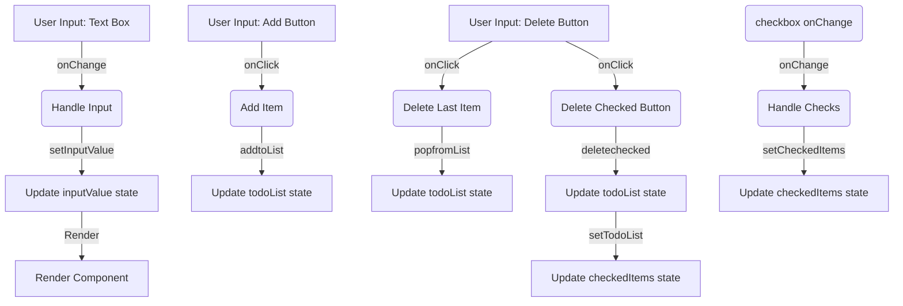

# React Mini Projects

- TO-DO - list :
    
    [https://codepen.io/Tanishq-Sadanala/pen/rNPwjzj?editors=1111](https://codepen.io/Tanishq-Sadanala/pen/rNPwjzj?editors=1111)
    
    ```jsx
    import React, { useState } from "react";
    import "./App.css";
    
    function App() {
      const [todoList, setTodoList] = useState(["add food", "exercise"]);
      const [inputValue, setInputValue] = useState("");
      const [checkedItems, setCheckedItems] = useState([]);
    
      function eventHandler(event) {
        setInputValue(event.target.value);
      }
    
      function addtoList() {
        setTodoList([...todoList, inputValue]);
      }
      function popfromList() {
        const updatedTodoList = todoList.slice(0, todoList.length - 1);
        setTodoList([...updatedTodoList]);
      }
    
      function handleChecks(key) {
        const newCheckedItems = [...checkedItems];
        newCheckedItems[key] = !newCheckedItems[key]
        setCheckedItems(newCheckedItems);
      }
    
      function checkbool(key) {
        return checkedItems[key] || false;
      }
      
      function deletechecked() {
        const newTodoList = todoList.filter((_, key) => !checkedItems[key]);
        setTodoList(newTodoList);
        setCheckedItems([]);
      }
    
      return (
        <div>
          <h1>To Do App</h1>
          <input type="text" value={inputValue} onChange={eventHandler} />
          <div>
            <button onClick={addtoList}>add</button>
            <button onClick={popfromList}>delete</button>
            <button onClick={deletechecked}>delete checked</button>
          </div>
          <ul>
            {todoList.map((value, key) => (
              <div>
                <input
                  type="checkbox"
                  onChange={() => handleChecks(key)}
                  checked={checkbool(key)}
                />
                {value}
              </div>
            ))}
          </ul>
        </div>
      );
    }
    
    export default App;
    
    ```
    
    Functionality Workflow:
    
    1. **Use States** : Finding out how many mutable things are on screen (including CSS changes).
        1. everything that changes on the screen
        2. So everything that you need., You should have a ref.
    2. Write the Render Function first and make the call-back functions next
    3. Write your logic to make the functions Work.    



- Simple quiz of music theory and music questions using API.
    - Using Hooks, States, API’s

[React Notes](https://www.notion.so/React-Notes-09c51a7b34f94366a115e9038e369802?pvs=21)